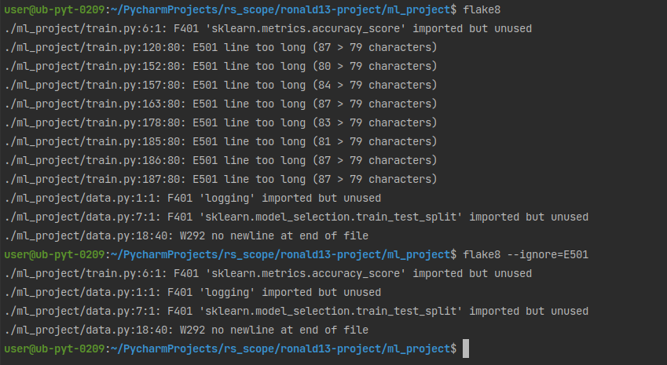
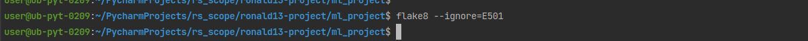

# Final RS scope Project
### This demo uses [Forest train dataset](https://www.kaggle.com/competitions/forest-cover-type-prediction).

Usage
This package allows you to train model for detecting the presence of heart disease in the patient.

1. Clone this repository to your machine.
2. Download [Forest train dataset](https://www.kaggle.com/competitions/forest-cover-type-prediction).
, save csv locally (default path is data/train.csv in repository's root).
3. Make sure Python 3.8 and Poetry are installed on your machine (I use Poetry 1.1.13).
4. Install the project dependencies (run this and following commands in a terminal, from the root of a cloned repository):

```sh
poetry install --no-dev
```
5. Run train with the following command:
```sh
poetry run train -d <path to csv with data> -s <path to save trained model>
```
You can configure additional options (such as hyperparameters) in the CLI. To get a full list of them, use help:
```sh
poetry run train --help
```
6. Run MLflow UI to see the information about experiments you conducted:
```sh
poetry run mlflow ui
```


## Development

The code in this repository must be tested, formatted with black, and pass mypy typechecking before being commited to the repository.

Install all requirements (including dev requirements) to poetry environment:
```
poetry install
```
Run [black](https://github.com/psf/black)
```sh
python -m black <PATH>
```
Run flake8 
```sh
python -m flake8 <PATH>
```
Run mypy 
```sh
python -m mypy <PATH>
```

#### LogisticRegression - Result


#### RandomForest - Result


#### Combine - Result


#### Black - Result


#### Flake8 - Before


#### Flake8 - After


#### Mypy - Result - almost successful
